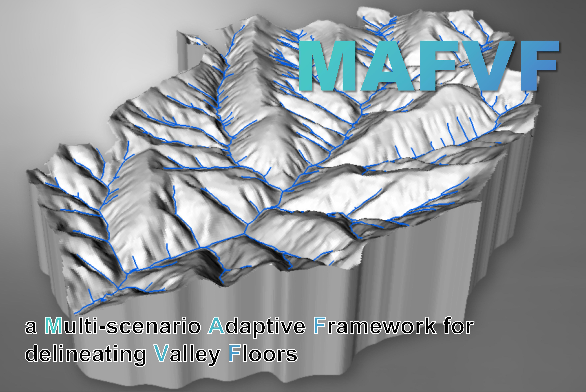
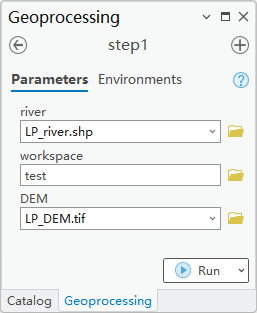
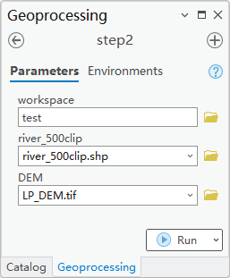
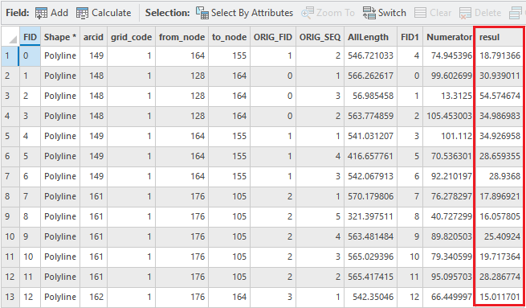
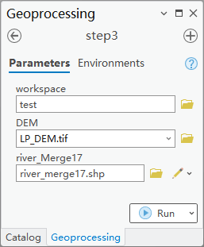
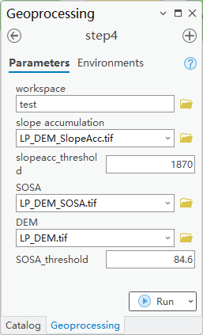

# MAFVF User Manual

## Overview
MAFVF (Multi-Scenario Adaptive Framework for Delineating Valley Floors) is a robust tool designed to facilitate the delineation of valley floors across diverse landscapes. This framework provides the core model, sample datasets, and step-by-step instructions for users. For further details on the methodology, please refer to the upcoming publication by Wenjie Sun et al. (in preparation).

## 1. Data Overview
The following table outlines the data utilized within the MAFVF framework, including descriptions and file paths.

| **Data**                | **Description**                                                                 | **Path**                       |
|-------------------------|---------------------------------------------------------------------------------|--------------------------------|
| DEM                     | The Digital Elevation Model (DEM) of the study area, projected for analysis.    | `MAVAF/data/LP_DEM.tif`        |
| Initial Drainage Network | The initial drainage network derived from terrain texture analysis.             | `MAVAF/data/LP_river.shp`      |
| Final Drainage Network   | The final drainage network, processed with longitudinal profile adjustments.    | `MAVAF/test/river_merge17.shp`      |
| ArcGIS Toolbox           | Core model for MAFVF methodology.                                                | `MAVAF/method.atbx`            |

## 2. Software Configuration
- **ArcGIS Pro Version:** 3.1.6

## 3. Step 1: River Segmentation

We have already derived the initial drainage threshold based on terrain texture indices from the example DEM data and have extracted the initial drainage network, which is projected and stored in `MAVAF/data/LP_river.shp`.

In this step, we compute the average river gradient from the longitudinal profile of the drainage network. The first task is to segment the river network.

1. Open ArcGIS Pro and load the `method.atbx` toolbox.
2. Double-click the **step1** model.
3. Input the following parameters:
   - **river** `MAVAF/data/LP_river.shp`
   - **workspace** `MAVAF/test`
   - **DEM** `MAVAF/data/LP_DEM.tif`
4. Click "Run" to output the segmented river network as `river_500clip.shp`.
   - **Estimated time:** 2 seconds.

## 4. Step 2: River Gradient

After segmenting the river network, we proceed to calculate the average gradient for each river segment.

1. Double-click the **Step2** model.
2. Input the following parameters:
   - **workspace:** `MAVAF/test`
   - **river_500clip** `MAVAF/test/river_500clip.shp`
   - **DEM** `MAVAF/data/LP_DEM.tif`
3. Ensure a folder named `table` exists in the `MAVAF/test/` directory.
4. Click "Run" to generate gradient data for each river segment. 
   - **Estimated time:** 4 minutes.

After processing, merge the river segments and output the result as `MAVAF/test/river_merge.shp`. Open the attribute table to observe the `resul` field, which contains the average gradient for each river segment. Export all features where `resul < 17` and save them as `MAVAF/test/river_merge17.shp`.

## 5. Step 3: Slope Accumulation & SOSA

In this step, we compute the Slope Accumulation and Slope of Slope Accumulation (SOSA) for the study area.

1. Double-click the **Step3** model.
2. Input the following parameters:
   - **workspace** `MAVAF/test`
   - **DEM** `MAVAF/data/LP_DEM.tif`
   - **river_merge17** `MAVAF/test/river_merge17.shp`
3. Click "Run" to generate the Slope Accumulation (`LP_DEM_SlopeAcc.tif`) and SOSA (`LP_DEM_SOSA.tif`) rasters.
   - **Estimated time:** 2 seconds.

## 6. Step 4: Delineate Valley Floor

In this final step, we delineate the valley floor based on changes in the frequency histograms of Slope Accumulation and SOSA, as detailed in the methodology section of the paper.

1. Double-click the **Step4** model.
2. Input the following parameters:
   - **workspace** `MAVAF/test`
   - **slope accumulation** `MAVAF/test/LP_DEM_SlopeAcc.tif`
   - **slopeacc_threshold** `1870`
   - **SOSA** `MAVAF/test/LP_DEM_SOSA.tif`
   - **SOSA_threshold** `84.6`
   - **DEM** `MAVAF/data/LP_DEM.tif`
3. Click "Run" to delineate the valley floor and output the results as `LP_DEM_valleyfloor.shp`.
   - **Estimated time:** 2 seconds.
